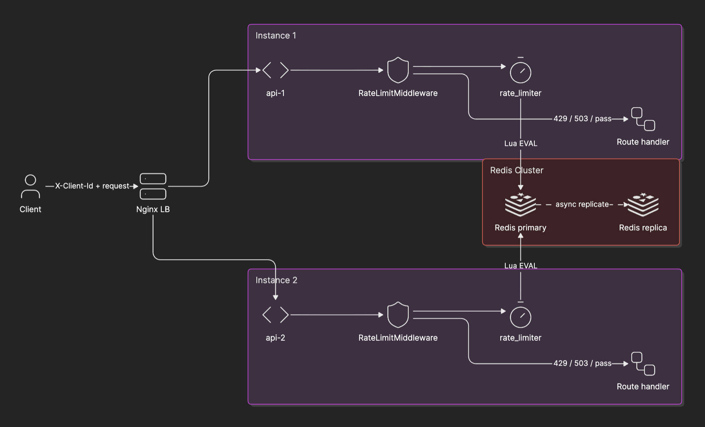
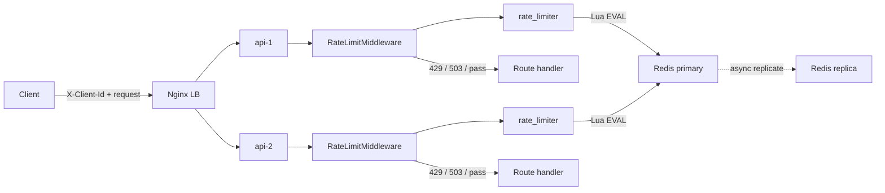

# Distributed Rate Limiter
 
In this document, I have captured the requirements, my design decisions & tradeoffs to meet the current requirements, 
the code details, failure semantics, load tests scenarios and results after I executed them locally, a future scalability horizon
and where I leveraged AI to help me achieve the project goal.

The 1st section gives a brief overview of the repository, the problem statement, how to execute the code and high level architecture.
Starting from 2nd section, I have deep dived into each decision I took during the design and where it fits in the overall solution.
## Table of Contents

- [1. System Architecture Overview](#1-system-architecture-overview)
  - [Requirements and Scale](#requirements-and-scale)
  - [High-level flow](#high-level-flow)
  - [1.1 Code map](#11-code-map)
  - [1.2 How to run](#12-how-to-run)
- [2. Integration Shape & Strategy](#2-integration-shape--strategy)
  - [Chosen approach](#chosen-approach)
  - [Rejected options](#rejected-options)
- [3. Rate Limiting Algorithm](#3-rate-limiting-algorithm)
  - [Selected algorithm: token bucket](#selected-algorithm-token-bucket)
- [4. Storage Choice](#4-storage-choice)
  - [Why redis?](#why-redis)
  - [Tradeoff](#tradeoff)
  - [Redis + Lua implementation](#redis--lua-implementation)
  - [Capacity at launch](#capacity-at-launch)
  - [Quota model](#quota-model)
  - [Config hot-reload (SIGHUP)](#config-hot-reload-sighup)
  - [In-memory fallback](#in-memory-fallback)
- [5. Failure Semantics](#5-failure-semantics)
  - [HTTP responses](#http-responses)
  - [Circuit breaker](#circuit-breaker)
  - [Code layout](#code-layout)
  - [Redis failover](#redis-failover)
  - [Monitoring before sharding](#monitoring-before-sharding)
- [6. Load Test Results & Bottlenecks](#6-load-test-results--bottlenecks)
  - [Automated tests (implemented)](#automated-tests-implemented)
  - [Planned load scenarios](#planned-load-scenarios)
  - [Metrics to report](#metrics-to-report)
  - [Results (fill after run)](#results-fill-after-run)
  - [Expected bottlenecks (before tests)](#expected-bottlenecks-before-tests)
- [7. Future Scalability (12-Month Horizon)](#7-future-scalability-12-month-horizon)
- [8. AI Assistance Disclosure](#8-ai-assistance-disclosure)

## 1. System Architecture Overview

A distributed rate limiter is required for a public API that runs on multiple instances. 
Limits must apply **per client** and **per route**, and the same quota must hold no matter which instance handles the request.

### **Requirements and Scale:**

The rate limiter should easily handle the following requirements**:**

- ~5,000 clients (expected to grow to 50000 in a year)
- ~40 API routes
- ~3,000 RPS on average
- ~15,000 RPS at peak
- Bursty traffic expected per client (for example ~100 RPS, then idle).
- The limiter must add <**10 ms** of latency per request (to ensure overall API SLA of <200ms is not impacted by rate limiting)
- Three client tiers exist: `free`, `standard`, and `enterprise`.

### **High-level flow:**

1. A client sends a request with a client identifier (for example `X-Client-Id`).
2. A load balancer sends the request to any one of the active API instance
3. **Middleware** runs before route handlers: it resolves the client tier and route via configuration, then checks the limit.
4. A single **Redis** call (Lua script) updates shared token state and returns allow or deny.
5. If allowed, the handler runs. If denied, the API returns **429**. If the limiter cannot run, the API returns **503** (fail-closed).

**Note:** In a real production application, figuring out the tier for a client using the clientId will not be done via configuration,
and for this demo, I have hardcoded a few clients and their tiers in the relevant configurations.

**Components:**

| Component                                                     | Role                                                                                                                                                         |
|---------------------------------------------------------------|--------------------------------------------------------------------------------------------------------------------------------------------------------------|
| Load balancer                                                 | Distributes traffic across instances; <br/> Currently running on default round robin for simplicity, can be easily configured to have ip_hash or random, etc |
| API instances (8 in production, used 2 in this repo for demo) | Stateless; middleware enforces limits on every request                                                                                                       |
| `rate_limiter` package                                        | Token bucket logic of rate limiting, config loading, Redis access, circuit breaker                                                                           |
| Redis primary                                                 | Shared counter state for all instances                                                                                                                       |
| Redis replica (Optional, activates when replica URL is set)   | Async copy for failover; Optionally configure it to continuously monitor primary redis and promote itself as primary if required                             |
| Config files (`limits.yaml`, `clients.yaml`)                  | Tier defaults, route overrides, client → tier mapping                                                                                                        |


**Diagram:**



<details>
<summary>Mermaid source (renders on GitHub; use the PNG above in editors without Mermaid preview)</summary>



</details>

#### *NOTE:*

**Production vs this repo:** Production uses eight API instances behind a load balancer. This repository uses two instances and nginx to prove that limits are global across instances, without running eight containers locally. The design pattern is the same.

### 1.1 Code map

Evaluators can use this table to navigate the implementation. More detail on libraries is in the [README](README.md).


| Path                                | Responsibility                                                         |
| ----------------------------------- | ---------------------------------------------------------------------- |
| `app/main.py`                       | FastAPI application and sample routes                                  |
| `app/middleware.py`                 | Middleware: client id, route key, 400 / 429 / 503                      |
| `rate_limiter/limiter.py`           | Single entry `allow(client_id, route)`                                 |
| `rate_limiter/redis_store.py`       | Redis pool; runs `lua/token_bucket.lua`                                |
| `rate_limiter/lua/token_bucket.lua` | Atomic token bucket (Redis HASH + EXPIRE)                              |
| `rate_limiter/circuit.py`           | Circuit breaker for fail-closed behavior                               |
| `rate_limiter/config.py`            | Loads YAML; resolves client → route → tier policy                      |
| `rate_limiter/config_reloader.py`   | SIGHUP-driven YAML hot-reload                                          |
| `rate_limiter/redis_failover.py`    | Optional primary health monitor + replica promotion                    |
| `rate_limiter/factory.py`           | Builds limiter from env; wires reloader and optional failover manager  |
| `configs/limits.yaml`               | Tier defaults and route overrides                                      |
| `configs/clients.yaml`              | Client tier mapping and optional overrides                             |
| `nginx/nginx.conf`                  | Round-robin to `api-1` and `api-2`                                     |
| `docker-compose.yml`                | Redis, replica, two APIs, nginx on port 8080                           |


### 1.2 How to run

**Full stack (single command to bring up the entire stack):**

```bash
docker compose up --build
```

Once the docker is up, in a separate terminal tab:

#### **To run the /v1/demo API route, run:**

```bash
curl -H "X-Client-Id: client-free-1" http://localhost:8080/v1/demo -v
```
You can further find more routes in app/main.py and clients configured in the /configs/clients.yaml. Per route overrides can be found in /configs/limits.yaml.

| Service               | Port          | Notes                                                |
| --------------------- | ------------- | ---------------------------------------------------- |
| nginx (load balancer) | 8080          | Use this for load tests and cross-instance checks    |
| Redis primary         | 6379          | Shared limit state                                   |
| Redis replica         | —             | Async replica of primary; app writes to primary only |
| api-1 / api-2         | internal 8000 | Not exposed directly; traffic goes through nginx     |


**Tests:**

```bash
pip install ".[dev]"
docker compose up -d redis
REDIS_URL=redis://localhost:6379/1 pytest -q
```

OR:

```bash
make test-unit
make test-integration (see README).
```

**Load tests (prerequisite: k6, e.g. `brew install k6`):**

```bash
docker compose up --build -d
make load-all
# or individual scenarios:
make load-baseline load-burst load-cross_instance load-concurrent load-hot_routes load-peak
```
Set `BASE_URL` if needed (default `http://localhost:8080`). See [§6 Load Test Results](#6-load-test-results--bottlenecks) for scenario descriptions and measured numbers.
**Note**: All services and load tests are intended to be run on a developer's local machine using Docker/Docker Compose. No cloud or production resource sizing is assumed.

**Environment variables:**

| Variable | Default | Purpose |
| -------- | ------- | ------- |
| `REDIS_URL` | `redis://localhost:6379/0` | Redis primary |
| `REDIS_REPLICA_URL` | *(empty)* | Enables in-process failover manager when set |
| `REDIS_TIMEOUT_MS` | `5` (50 in Docker) | Redis socket timeout |
| `REDIS_FAILOVER_CHECK_INTERVAL_SEC` | `5` | Primary health poll interval |
| `REDIS_FAILOVER_THRESHOLD` | `3` | Consecutive failures before replica promotion |
| `CIRCUIT_FAILURE_THRESHOLD` | `5` | Failures to open circuit |
| `CIRCUIT_FAILURE_WINDOW_SEC` | `10` | Rolling failure window |
| `CIRCUIT_OPEN_DURATION_SEC` | `30` | Open → half-open cooldown |
| `CIRCUIT_SUCCESS_THRESHOLD` | `3` | Probes to close circuit |
| `CONFIG_DIR` / `LIMITS_PATH` / `CLIENTS_PATH` | `./configs/...` | Config file locations |
| `INSTANCE_NAME` | `local` | Shown on `/health` |

See [`.env.example`](.env.example) for a copy-paste template.

### Note: Please check [README.md](README.md) for more details on how the code and tests.

---

## 2. Integration Shape & Strategy

Rate limiting is applied in **middleware** that runs on every request(except for the exempty paths like /health) before business logic. A small shared Python package (`rate_limiter`) holds the core logic; middleware calls into it. The package is not exposed as a separate network service.
Middleware has an abstracted interaction with the rate limiter ensuring they are not tightly coupled and gives flexibility to our solution.

### Chosen approach


| Piece                  | Role                                                                                           |
| ---------------------- |------------------------------------------------------------------------------------------------|
| Middleware             | Reads client id and route, calls the limiter, returns 429 or 503 or passes the request through |
| `rate_limiter` package | Token bucket algorithm, Redis Lua script, config load, circuit breaker                         |


Config changes are applied at the middleware layer (reload YAML or redeploy instances) without updating many downstream services separately.

**Middleware details** (`app/middleware.py`):

- **Exempt paths** (no rate limit check): `/health`, `/docs`, `/openapi.json`, `/redoc`
- Route key format: `{METHOD} {path}` (for example `GET /v1/demo`)
- Missing or unknown `X-Client-Id` → **400** (rejected before Redis is called)
- Allowed responses include `X-RateLimit-Remaining` and `X-RateLimit-Reset` headers

### Rejected integration options


| Option                                          | Reason for rejection                                                                                                                                               |
| ----------------------------------------------- |--------------------------------------------------------------------------------------------------------------------------------------------------------------------|
| **Sidecar**                                     | An extra container and network hop per service; higher latency and more operations when many microservices exist                                                   |
| **Dedicated rate-limit microservice**           | Every request needs an extra API call over network before the API; middleware plus one Redis call is simpler and faster                                            |
| **Library only, embedded in each microservice** | Fleet-wide limits still need shared Redis, but each service must be redeployed to change limits or library version; risk of inconsistent behavior across instances |
| **In-memory limiting per instance**             | Does not meet the requirement; quotas would not be shared across the fleet                                                                                         |


A library is still used, but only as implementation code called from middleware—not as the sole integration point in every service independently.

---

## 3. Rate Limiting Algorithm

### Selected algorithm: token bucket (logic executed as a lua script in redis instance)


| Algorithm          | Outcome      | Reason                                                                                                     |
| ------------------ | ------------ | ---------------------------------------------------------------------------------------------------------- |
| Fixed window       | Rejected     | Allows extra traffic at window boundaries; clients can be blocked for the rest of the window after a burst |
| Sliding window log | Rejected     | Stores many timestamps per key; high memory and CPU at 15k RPS                                             |
| **Token bucket**   | **Selected** | Steady `rate_per_sec` plus `burst` capacity; fits “many requests in one second, then idle”                 |
| Leaky bucket       | Rejected     | Smooths traffic too aggressively for bursty API clients                                                    |

With the loose coupling between middleware and rate limiter, different algorithms can be implemented and integrated without changing the entire code.

## 4. Storage Choice

Selected Redis to be the storage option for storing the counters for each client and each route.

### Why redis?

- Its super fast as it stores data in-memory (RAM) thus allows for fast writes and reads.
  - This ensures our API latency is impacted negligibly by our rate limiter (<10ms).
- Its single threaded thus avoid consistency issues due to concurrent operations.
  - HOWEVER, since there are two steps involved with each operation (check counter and update), it requires transactional support to perform this operation atomically. Solved this using a LUA script, more details are below.
- Can easily handle throughputs of 100k to 1M RPS, sufficient for our usecase (even with scale 12months down the line)
- Can easily handle storage of the desired set of client and route keys. See calculations below.
- TTL is attached to each key in case the key is stale for atleast 60 sec.
- Since the counters change very frequently, storing them in a persist storage adds latency and cost and is not necessary.

### Tradeoff

- Redis stores data in-memory and in case of redis instance crashing, due to the async replication lag, there can be minor inconsistencies when backup instance is promoted.
- However, a rate limiter does not store any critical information about the users and thus is a relevant tradeoff to make.

### Redis + Lua implementation

Each limit is keyed as `rl:{client_id}:{METHOD} {path}` (for example `rl:client-free-1:GET /v1/demo`). The route segment is the HTTP method plus path, not unbounded URLs with query parameters.

- All instances are stateless; **Redis primary** holds tokens and last refill time per key.
- State is stored as a Redis **HASH** with fields `tokens` and `last_refill`.
- Each check runs as **one Lua script** on Redis: compute refill from elapsed time, subtract one token if available, save state, return `allowed`, `remaining`, `reset_at`, `retry_after`.
- Inactive keys expire automatically: TTL is `max(60, ceil((burst / rate) * 2) + 60)` seconds.
- The script is registered once via `register_script` for efficient `EVALSHA` on subsequent calls.
- One round-trip per request keeps latency low and avoids race conditions when many instances hit the same client at once.
- Connection pooling and a **2–5 ms** client timeout are used so a slow Redis does not block the API for hundreds of milliseconds (Docker compose uses 50 ms for local dev stability).

### Capacity at launch

Only active `(client, route)` pairs use memory. A conservative estimate is 2 KB per key. At launch 5k clients × 40 routes, worst-case memory is on the order of **~400 MB** if every pair were active; at 50k clients the upper bound is on the order of **~4 GB**. A single Redis instance with 8–16 GB RAM is sufficient for launch; **cluster mode is not required for memory alone.**

A **replica** is deployed for high availability. The application reads and writes **only the primary**. The replica is for failover, not for serving limit checks (async lag could allow incorrect counts).

### Quota model

Limits are defined in YAML, not hardcoded.

**Resolution order** (as implemented in `rate_limiter/config.py`):

1. Client must exist in `clients.yaml` (unknown client → **400**)
2. **Client override** — per-client route override in `clients.yaml`
3. **Route override** — tier-specific limit for that route in `limits.yaml`
4. **Tier default** — fallback from the client's tier


| Tier       | rate/sec | burst | Notes                                           |
| ---------- | -------- | ----- | ----------------------------------------------- |
| free       | 10       | 20    | Low steady rate; burst is 2× rate               |
| standard   | 50       | 100   | Mid tier                                        |
| enterprise | 100      | 200   | Matches ~100 req/s burst described in the brief |


Example route overrides (top or expensive routes):


| Route              | free (rate/burst) | standard     | enterprise   |
| ------------------ | ----------------- | ------------ | ------------ |
| default            | tier default      | tier default | tier default |
| `GET /v1/search`   | 5 / 10            | 25 / 50      | 80 / 160     |
| `POST /v1/reports` | 2 / 4             | 10 / 20      | 40 / 80      |


Optional per-client overrides can raise limits for specific enterprise tenants on specific routes without changing the enterprise tier for everyone.

### Config hot-reload (SIGHUP)

Config is loaded at startup and can be hot-reloaded without restarting the API process. During rollout, instances may briefly use different limits; that is accepted in favor of keeping the API available.

**Implementation** (`rate_limiter/config_reloader.py`, wired in `rate_limiter/factory.py`):

- On startup, `ConfigReloader` registers a `SIGHUP` signal handler.
- On `SIGHUP`, reloads `limits.yaml` and `clients.yaml` from disk and calls `RateLimiter.set_config()` with the new config.
- Failed reloads are logged; the previous in-memory config remains active.
- Redis token state is unchanged; new rates and bursts apply on the next refill for each key.

### In-memory fallback

An in-memory limiter inside middleware when Redis is down is **not** used. It would enforce different quotas per instance and would break fleet-wide consistency.

---

## 5. Failure Semantics

When Redis cannot be reached or does not respond in time, the system uses **fail-closed** behavior: requests are **rejected** rather than allowed through without a limit check. This protects the API from overload and abuse when limits cannot be enforced.

> **Note:** Fail-closed means traffic is blocked when the limiter is unhealthy—not “fail-open,” which would allow unlimited traffic during an outage.

### HTTP responses


| Condition                                     | Status    | Behavior                                                                     |
| --------------------------------------------- | --------- | ---------------------------------------------------------------------------- |
| Over quota                                    | **429**   | `Retry-After`, `X-RateLimit-Remaining`, `X-RateLimit-Reset` where applicable |
| Redis error, timeout, or open circuit breaker | **503**   | Client should retry with backoff                                             |
| Missing or unknown client id                  | **400**   | Rejected before Redis is called                                              |


### Circuit breaker

A circuit breaker runs **per API process** to avoid hammering Redis when it is failing.


| Stage           | Behavior                                                                                                  |
| --------------- | --------------------------------------------------------------------------------------------------------- |
| Closed (normal) | Each request calls Redis with a short timeout                                                             |
| Open            | After repeated failures (for example ~5 in 10 seconds), Redis is skipped; **503** is returned immediately |
| Half-open       | After a cooldown (for example ~30 seconds), one probe request tests Redis                                 |
| Closed again    | After several successful probes (for example 3), normal operation resumes                                 |


While the circuit is open, no Redis calls are made. That keeps response time low and reduces load on a struggling Redis.

On Redis failover, `CircuitBreaker.reset_on_failover()` transitions the breaker to **half-open** immediately so the new primary can be probed without waiting for the open-duration cooldown.

### Code layout


| Module                          | Responsibility                           |
| ------------------------------- | ---------------------------------------- |
| `app/middleware.py`             | Invoke limiter; map results to 429 / 503 |
| `rate_limiter/limiter.py`       | Timeouts, breaker, orchestration         |
| `rate_limiter/redis_store.py`   | Connection pool, Lua `EVAL`              |
| `rate_limiter/circuit.py`       | Breaker state machine                    |
| `rate_limiter/redis_failover.py`| Optional primary monitor + promotion     |
| `rate_limiter/config_reloader.py`| SIGHUP config reload                    |


### Redis failover

**Production:** On primary failure, infrastructure (or Sentinel) may promote the replica. Applications reconnect to the new primary via DNS or updated `REDIS_URL`. Counters may reset briefly; a short period of possible over-admission is accepted compared to having no limits during an outage.

**In-process failover manager** (`rate_limiter/redis_failover.py`):

This repository includes an optional `RedisFailoverManager` that complements infra-level promotion. It is enabled when `REDIS_REPLICA_URL` is set (not configured in the default `docker-compose.yml`; the replica container runs but API services only set `REDIS_URL`).

| Behavior | Detail |
| -------- | ------ |
| Health check | Background thread pings primary every `REDIS_FAILOVER_CHECK_INTERVAL_SEC` (default 5 s) |
| Promotion | After `REDIS_FAILOVER_THRESHOLD` consecutive failures (default 3), runs `SLAVEOF NO ONE` on the replica |
| Circuit breaker | Calls `reset_on_failover()` → immediate **half-open** probe instead of waiting 30 s |
| Limitation | The app's Redis client still points at the original primary URL; production would also update `REDIS_URL` or DNS after promotion |

### Monitoring before sharding

At launch, metrics should include Redis memory, CPU, command latency, limiter latency, allow/deny counts, breaker state, and hot keys. If a single client or route dominates, **config overrides** are adjusted first. **Redis Cluster** is considered only if metrics show sustained CPU or latency problems after tuning.

---

## 6. Load Test Results & Bottlenecks

Load tests use **k6** scripts under `load/scenarios/`. **Measured numbers should be pasted here after running against a live stack** (`docker compose up --build`, then `./scripts/run_load.sh <scenario>`).

### Automated tests (implemented)


| Test file                                           | What it checks                                    |
| --------------------------------------------------- | ------------------------------------------------- |
| `tests/unit/test_circuit.py`                        | Circuit opens, half-open, closes                  |
| `tests/unit/test_circuit_failover.py`               | `reset_on_failover` → half-open, clears failures  |
| `tests/unit/test_config.py`                         | Tier, route, and client override resolution       |
| `tests/unit/test_config_reloader.py`                | SIGHUP handler registration, reload callback      |
| `tests/unit/test_redis_failover.py`                 | Failover threshold, promotion callback            |
| `tests/unit/test_limiter.py`                        | Redis key format                                  |
| `tests/integration/test_redis_limiter.py`           | Token bucket burst and separate client keys       |
| `tests/integration/test_distributed_consistency.py`   | Two limiter instances share one Redis quota       |
| `tests/integration/test_fail_closed.py`             | 503 path when Redis is unreachable; breaker opens |
| `tests/integration/test_middleware.py`              | HTTP 400 / 429 / health bypass                    |
| `tests/integration/test_config_reload_integration.py`| Limiter picks up new limits after reload         |


Integration tests require Redis (`REDIS_URL`, default database `1` for isolation).

### Load test scenarios (k6)

Production targets from the assignment are **~3k avg / ~15k peak RPS**. Local Docker runs use lower rates that the laptop can sustain; results below are from `docker compose up --build` on Apple Silicon M1 Chip.

**Prerequisite:** [k6](https://grafana.com/docs/k6/latest/set-up/install-k6/) installed, stack running on port 8080.

| Scenario | Script | Make target | What it validates                                                                                                                     |
| -------- | ------ | ----------- |---------------------------------------------------------------------------------------------------------------------------------------|
| Baseline | `load/scenarios/baseline.js` | `make load-baseline` | Sustained **200 RPS** mixed clients (3 tiers) and routes (5); steady latency under rate limiting                                      |
| Burst | `load/scenarios/burst.js` | `make load-burst` | One enterprise client at **200 RPS for 2s**; token bucket burst then 429                                                              |
| Cross-instance | `load/scenarios/cross_instance.js` | `make load-cross_instance` | Same `client-free-1` + `GET /v1/demo` through **nginx**; high 429 rate proves **one global quota** (burst 6), not 2× per API instance |
| Concurrent | `load/scenarios/concurrent.js` | `make load-concurrent` | **30 VUs** rotating 3 clients × 3 routes; separate Redis keys, no cross-client bleed                                                  |
| Hot routes | `load/scenarios/hot_routes.js` | `make load-hot_routes` | **150 RPS** with **80%** traffic on five popular routes                                                                               |
| Peak | `load/scenarios/peak.js` | `make load-peak` | Ramp **100 → 300 → 600 RPS** over 40s; find local saturation point                                                                    |
| All | — | `make load-all` | Runs every scenario sequentially                                                                                                      |

**Run one scenario:**

```bash
docker compose up --build -d
make load-baseline
# or: ./scripts/run_load.sh baseline
BASE_URL=http://localhost:8080 TARGET_RPS=300 make load-baseline
```

JSON summaries are written to `load/results/<scenario>.json`.

**Demo config (minimal):** Four clients in `configs/clients.yaml` (one per tier and one enterprise extra) and five routes in `app/main.py` cover tier defaults, route overrides, per-client override (`client-enterprise-1` on `GET /v1/shipments`), and a POST route (`POST /v1/reports`). This is enough to exercise all policy and load scenarios without simulating 5k clients or 40 routes.

**Redis failure (manual):** Stop Redis (`docker compose stop redis`) and send requests — expect **503** and circuit breaker open. Not automated in k6 because it requires infra manipulation mid-run.


### Metrics to report

- Achieved RPS vs target
- Limiter latency p50, p95, p99
- End-to-end p99
- Share of 429 vs 503
- Redis CPU and memory
- First point of failure (for example p99 > 10 ms, error spike, Redis saturation)

### Results (local Docker, May 2026)

Environment: `docker compose up --build`, nginx `:8080`, 2 API instances, Redis 7, k6 v2.0.0, Apple Silicon Mac.

| Scenario | Target RPS  | Achieved RPS | p95    | p99     | max      | 429 rate | 503 rate | Notes                                                                          |
| -------- |-------------|--------------|--------|---------|----------|----------| -------- |--------------------------------------------------------------------------------|
| baseline | 200         | 200          | 1.8 ms | 4.0 ms  | 71.8 ms  | 21.0%    | 0% | Mixed traffic; p95 limiter overhead under 10 ms                                |
| burst | 200 (2s)    | 200          | 7.2 ms | 12.5 ms | 21.2 ms  | 0.75%    | 0% | Enterprise tier default (burst 200); 3 / 400 requests rate limited             |
| cross_instance | 50          | 50           | 7.2 ms | 14.0 ms | 47.1 ms  | 93.3%    | 0% | Expected: `client-free-1` burst is 6 on `GET /v1/demo`; global quota via nginx |
| concurrent | 30 VUs      | ~3,000       | 8.4 ms | 29.3 ms | 77.5 ms  | 87.3%    | 0% | High 429 rate from few clients under heavy parallel load                       |
| hot_routes | 150         | 150          | 2.4 ms | 4.8 ms  | 85.5 ms  | 18.5%    | 0% | 80% traffic on five routes                                                     |
| peak | ramp to 600 | ~318 avg     | 1.8 ms | 4.4 ms  | 284.4 ms | 31.1%    | 0% | Local stack below 15k target; max latency spike at top of ramp                 |

**Where it falls over locally:** Peak ramp to 600 RPS is fine for latency at p95 (~4 ms), but p99 spikes (~284 ms) under ramp stress. Production 3k/15k RPS would require more API instances than 2 instances, Redis tuning, and hardware — not validated on this laptop demo. No 503 errors observed while Redis was healthy.

**Reproduce:** `make load-all` after `docker compose up --build -d`.

---

## 7. Future Scalability (12-Month Horizon)

Growth is expected from ~5,000 to ~50,000 clients. The launch design should not be over-built on day one, but the path to scale should be clear.

| Area                 | At launch                                                   | At ~12 months                                                                                                                                                                         |
| -------------------- |-------------------------------------------------------------|---------------------------------------------------------------------------------------------------------------------------------------------------------------------------------------|
| Clients              | ~5k                                                         | ~50k                                                                                                                                                                                  |
| Redis                | One primary + one replica                                   | First try with bigger instance and **Redis Cluster** if CPU, latency, or ops metrics are at capacity; memory alone can still fit on one large node (~4 GB upper-bound estimate for all active keys) |
| API instances        | 8 behind load balancer; autoscaling on CPU, RPS, or latency | Larger autoscaled fleet; instances remain stateless                                                                                                                                   |
| Config               | YAML files, reload on SIGHUP or deploy                      | **etcd** or **ZooKeeper**: gateways watch a key and swap config in memory without redeploying all services                                                                            |
| Hot clients / routes | Route and client overrides in config                        | Monitoring-driven overrides; shard Redis only if hot keys remain after tuning                                                                                                         |
| Regions              | Single region                                               | Optional regional Redis and routing if latency requires it                                                                                                                            |
| Ingress              | Middleware in the API process                               | Optional managed ingress (for example AWS API Gateway with a custom authorizer) still backed by Redis                                                                                 |

Optionally for future, a more managed solution like AWS Fargate and ALB along with ElastiCache Redis is a good choice to support 15k RPS.
**Sharding approach (if needed):** Keys `rl:{client_id}:{route}` spread across cluster slots naturally. Hash tags are avoided unless a specific hot-key problem requires them. Regional shards are a product decision (per-region vs global quota).

**Config without redeploy (etcd / ZooKeeper):** A new limit document is written to a watched path. Each middleware instance reloads an in-memory snapshot when the watch fires. Redis token state is unchanged; new rates and bursts apply on the next refill.

---

## 8. AI Assistance Disclosure
  
In this project, I leveraged AI agent for implementing the code for the project as per the 
design decisions and implementation guidelines I provided them.
I reviewed their code, validated the tests and ran the application and tests 
and note down the results of the load tests
I also used AI agent to format the .md files that is more structured

Explicitly below are the steps I leveraged AI:
 - Code implementation and tests (including the load test scripts)
 - README.md creation
 - DESIGN.md formatting
 - Creating the mermaid diagram for the design